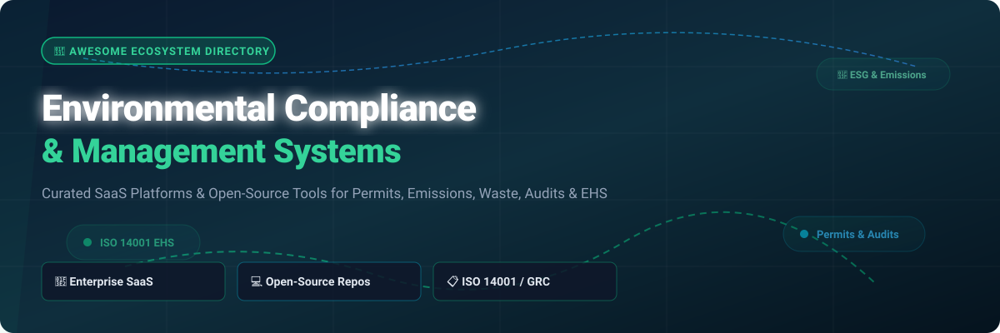

  
  
  
  
  
  
  

# 🌿 Awesome Environmental Compliance Management

> **Curated Ecosystem of Commercial SaaS Platforms & Open-Source Tools**  
> *Focused on Environmental Permits, Air & Water Emissions, Hazardous Waste Management, Audits, ISO 14001 Regulatory Tracking, CAPA & EHS Compliance.*

---

## 📌 Table of Contents
- [📖 Overview & SEO Focus](#-overview--seo-focus)
- [🏢 SaaS & Hosted EHS Platforms](#-saas--hosted-ehs-platforms)
- [💻 Open-Source GitHub Repositories](#-open-source-github-repositories)
- [🤝 How to Contribute](#-how-to-contribute)
- [⚖️ Disclaimer](#%EF%B8%8F-disclaimer)
- [💖 Support & Sponsorship](#-support--sponsorship)
- [📈 Star History](#-star-history)

---

## 📖 Overview & SEO Focus

**Environmental Compliance Management (ECM)** systems help industrial, manufacturing, and commercial enterprises systematically track legal environmental obligations. Core pillars of effective EHS compliance include:
- 📜 **Permit & License Tracking:** Managing air, water, and waste permit expiration dates, renewals, and submittal conditions.
- 🏭 **Emissions & GHG Accounting:** Monitoring Scope 1, 2, and 3 carbon emissions, continuous emissions monitoring systems (CEMS), and discharge monitoring reports (DMR).
- ☣️ **Hazardous Material & Waste Stream Management:** Tracking RCRA/hazardous waste manifestations, chemical inventories (SDS), and spill reporting workflows.
- 📋 **ISO 14001 Audits & Inspections:** Conducting recurring digital site audits, non-conformance tracking, and Corrective and Preventive Action (CAPA) tracking.

This repository compares leading enterprise commercial **SaaS suites** with high-performing **open-source frameworks** to assist EHS directors, sustainability engineers, and software architects in building defensible compliance technology stacks.

---

## 🏢 SaaS & Hosted EHS Platforms

> 📊 **Sector Market Intelligence (2026):** The global Environmental Compliance & EHS Software market is estimated at **$8.5 Billion – $10.2 Billion**, projected to reach over **$14.5 Billion by 2030** (~11.5% CAGR). The sector is **moderately fragmented**, undergoing active enterprise consolidation led by global strategic acquirers (Wolters Kluwer, Blackstone, Thoma Bravo, Fortive), while a diverse mid-market and specialized open-source tools prevent a single "winner-take-all" outcome.

| 🏢 SaaS Platform | 💰 Valuation / Estimated Revenue | 🏷️ Starting Price (Specific) | ⏳ Free Tier / Trial Limits (Specific) | 🛠️ Core Environmental Capabilities |
| :--- | :--- | :--- | :--- | :--- |
| **[Sphera](https://sphera.com/)** | **~$3.0 Billion** *(Blackstone; ~$250M-$300M Revenue)* | **~$15,000 / year** ($1,250/mo basic module) | **14-day sandbox trial** (Guided demo; no free-forever plan) | Enterprise permit tracking, hazardous chemical stewardship, air/water emissions logging, and ESG compliance risk analytics. |
| **[Enablon (Wolters Kluwer)](https://www.enablon.com/)** | **~$1.2+ Billion** *(Parent Rev €6.1B; ~$180M Unit Rev)* | **~$50,000 / year** ($4,166/mo enterprise contract) | **14-day request-based sandbox** (Sales-assisted demo; no free-forever plan) | Multi-site regulatory compliance registers, air emission calculations, CEMS data ingestion, and audit program management. |
| **[Cority (Thoma Bravo)](https://www.cority.com/)** | **~$800M – $1.0 Billion** *(~$150M-$200M Revenue)* | **~$40,000 / year** ($3,333/mo starting sub) | **14-day guided POC trial** (Request-based access; no free-forever plan) | Unified EHSQ suite for environmental obligation tracking, discharge water monitoring, waste manifests, and CAPA engine. |
| **[VelocityEHS](https://www.velocityehs.com/)** | **~$750M – $900M** *(~$124M+ Annual Revenue)* | **~$12,000 / year** ($1,000/mo chemical/safety suite) | **14-day free trial** (Chemical SDS module demo; no free-forever plan) | Chemical SDS inventory control, ergonomics, environmental incident reporting, and air pollutant release tracking. |
| **[Intelex (Fortive)](https://www.intelex.com/)** | **$570 Million** *(Acquisition value; Parent Rev $6.2B)* | **~$44 / user / month** ($528/yr per user, min 25 users = ~$13,200/yr) | **14-day sandbox trial** (Form request required; no free-forever plan) | ISO 14001 digital audits, permit condition tracking, wastewater discharge reporting, and environmental non-conformance CAPA. |
| **[EcoOnline](https://www.ecoonline.com/)** | **~$500 Million** *(Apax Partners; ~$67M-$90M Revenue)* | **~$3,500 / year** ($290/mo entry safety suite) | **14-day free trial** (Instant setup demo available; no free-forever plan) | European & North American chemical safety, hazardous waste tracking, workplace risk assessments, and environmental incidents. |
| **[ProcessMAP (Ideagen)](https://www.processmap.com/)** | **~$450 Million** *(Hg Capital; Group Rev ~$250M+)* | **~$10,000 / year** ($833/mo starting package) | **14-day custom demo trial** (Guided environment; no free-forever plan) | Environmental metrics monitoring, spill tracking, real-time telemetry dashboards, and multi-site EHS compliance calendars. |
| **[Benchmark ESG](https://www.benchmarkesg.com/)** | **~$350M – $400 Million** *(~$60M-$80M Revenue)* | **~$8,000 / year** ($666/mo entry digital suite) | **14-day POC trial** (Request-based trial; no free-forever plan) | Gensuite-powered environmental permit registers, multi-site compliance auditing, equipment monitoring, and ESG reporting. |
| **[Quentic (AMCS Group)](https://www.quentic.com/)** | **~$360 Million** *(€350M Acquisition value)* | **~$6,000 / year** ($500/mo starting package) | **14-day free trial** (Upon request; no free-forever plan) | European environmental law compliance, hazardous substance registers, ISO 14001 / 50001 audit workflows, and eco-analytics. |
| **[IsoMetrix](https://www.isometrix.com/)** | **~$150M – $200 Million** *(Carlyle Group; ~$30M-$40M Rev)* | **~$5,000 / year** ($416/mo starting tier) | **14-day request-based trial** (Guided setup; no free-forever plan) | Environmental risk management, tailing management, land usage, legal compliance obligation tracking, and ESG metrics. |

---

## 💻 Open-Source GitHub Repositories

> 💡 **Open-Source Reality in EHS:** Commercial enterprise suites dominate multi-site permit management and regulatory update services. However, open-source building blocks—such as no-code inspection databases, BI reporting engines, spatial GIS layers, and carbon accounting SDKs—provide high-control, cost-effective infrastructure for internal engineering teams.

The repositories below are sorted by **GitHub Star Count (Descending)**:

| 📦 Open-Source Repository | ⭐ GitHub Star Count | 🎯 EHS & Environmental Compliance Use-Case |
| :--- | :--- | :--- |
| **[NocoDB](https://github.com/nocodb/nocodb)** |  | Open-source Airtable alternative used to build custom environmental permit registers, inspection logs, and hazardous waste trackers. |
| **[Metabase](https://github.com/metabase/metabase)** |  | Open-source business intelligence platform for visual environmental compliance dashboards, emission trends, and audit reporting. |
| **[Appsmith](https://github.com/appsmithorg/appsmith)** |  | Low-code framework for constructing custom mobile/desktop internal EHS audit tools, field inspection forms, and spill incident reporting apps. |
| **[ERPNext](https://github.com/frappe/erpnext)** |  | Full open-source enterprise ERP including ISO 14001 quality management, asset maintenance, safety inspections, and document version control. |
| **[QGIS](https://github.com/qgis/QGIS)** |  | Premier open-source Geographic Information System (GIS) used to map facility boundaries, environmental monitoring wells, and regional emissions. |
| **[Cloud Carbon Footprint](https://github.com/cloud-carbon-footprint/cloud-carbon-footprint)** |  | Open-source engine for measuring and reporting cloud energy consumption and Scope 3 greenhouse gas carbon emissions across AWS, Azure, and GCP. |
| **[Awesome Green Software](https://github.com/Green-Software-Foundation/awesome-green-software)** |  | Green Software Foundation's curated directory of tools, standards, and open specifications for environmental impact & carbon reduction. |
| **[Carbon Aware SDK](https://github.com/Green-Software-Foundation/carbon-aware-sdk)** |  | Web API and command-line SDK for fetching real-time grid carbon intensity data to schedule compute workloads during low-emissions periods. |
| **[Open Sustainability Index](https://github.com/protontypes/open-sustainability-index)** |  | Open dataset and catalog tracking over 1,000 open-source climate, environmental monitoring, and sustainability software repositories. |
| **[Awesome HSE](https://github.com/SmartQHSE/awesome-hse)** |  | Curated list of Health, Safety, and Environment (HSE) regulation references, compliance calculation scripts, datasets, and audit checklists. |

---

## 🤝 How to Contribute

Contributions are welcome and greatly appreciated! 

1. **Fork the Repository:** Click the `Fork` button at the top right of this page.
2. **Add/Modify Entries:** Edit `README.md` to update or add software tools.
3. **Format Standard:** Follow the existing Markdown table format. Provide factual descriptions and link to official project or company websites.
4. **Submit a Pull Request:** Describe your changes and reference any verifiable sources.

---

## ⚖️ Disclaimer

- This list is **community-curated** for educational and research purposes.
- Environmental compliance software supports legal and regulatory obligations. Incomplete or inaccurate data logging can result in legal liability, fines, and environmental damage. 
- Open-source tools are **not** a plug-and-play substitute for certified, audited EHS management programs. Always consult qualified legal and environmental engineering professionals.

---

## 💖 Support & Sponsorship

If you find this curated directory helpful for your EHS research, corporate compliance planning, or open-source engineering, please consider supporting the project!

- ⭐ **Star this repository** to increase its visibility on GitHub.
- 🔀 **Fork & Share** with fellow EHS specialists, developers, and sustainability managers.
- ☕ **Sponsor the Maintainer:** Support ongoing curation and open-source maintenance via GitHub Sponsors:

  

---

## 📈 Star History

  Maintained with ❤️ by <a href="https://github.com/ishandutta2007">Ishan Dutta</a> and the Open-Source EHS Community.

